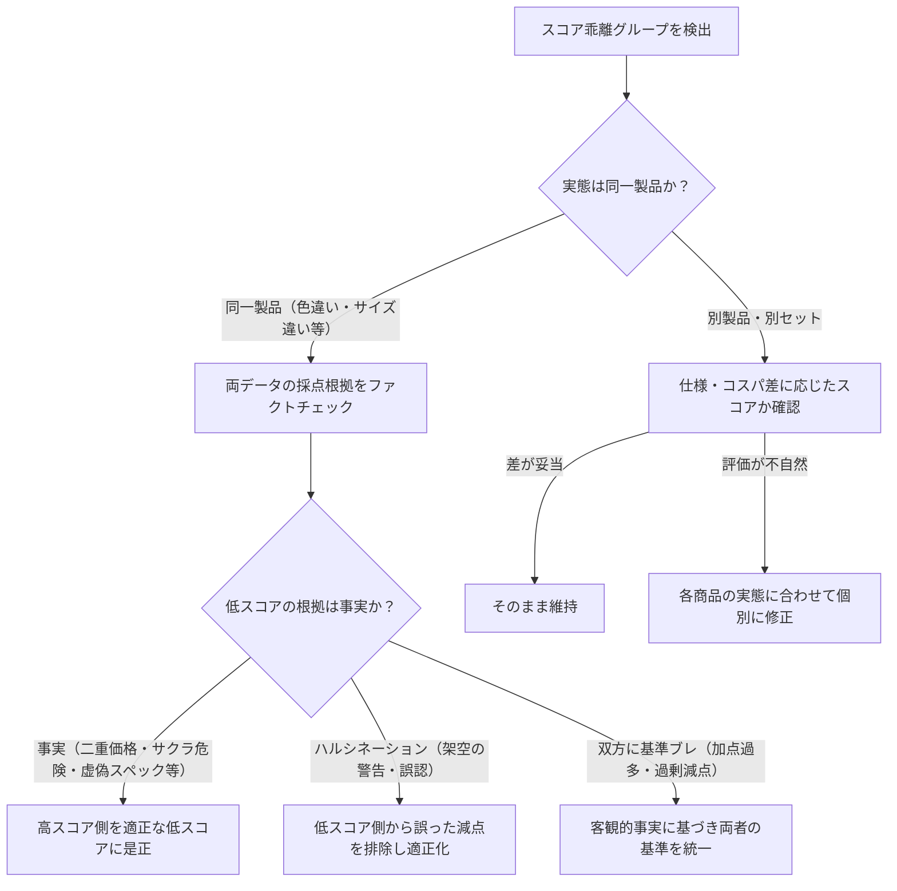

# 同一商品・バリエーション間スコア乖離 調査・是正ワークフロー

同一親ASIN（`parentAsin`）に属するバリエーション商品（カラー違い、サイズ・容量違いなど）において、調査データ間のスコアが大きく乖離しているものを検出し、客観的事実に基づいた原因の特定とスコアの適正化・データ整理を行う手順です。

## 1. 概要

- **スコア乖離の主な原因**:
  1. **AIハルシネーションによる架空の減点/加点（要注意）**:
     過去の調査において、AIが架空のサクラ危険警告（サクラ度90%等）や存在しない不具合を捏造して不当に低スコア（例: 40点）をつけていたケース、または逆に過大評価したケース。
  2. **同一製品における評価基準のブレ（要是正）**:
     同一モデルの色違い等であるにもかかわらず、一方では「二重価格（異常割引率）に対する減点（-20点）」が適用され、もう一方では見落とされてカタログスペック加点（+20点）が積み上がったケース。
  3. **親ASIN共有だが実態が別製品のケース（妥当な場合あり）**:
     Amazonのカタログ統合により、本体と付属品（例: レゴ本体と基礎板、スマホ本体とケース）が同一親ASINに紐付いているケース。
  4. **容量・セット内容の違いによるコスパ差（妥当な場合あり）**:
     大容量パックの方が単価が安くスコアが高くなっているケース。
- **対象ファイル**:
  - `data/investigations/<ASIN>.json`（調査レポート）
  - `content/articles/<ASIN>.md`（生成済み記事）
  - `data/cache/paapi-product-cache.json`（商品キャッシュ）

---

## 2. 監査手順 (Audit)

### 2.1 スコア乖離グループの一覧検出
全調査データから、同一親ASIN内でスコア差が一定以上あるグループを検出します。

```bash
# デフォルト（スコア差10点以上）を検出
pnpm run audit:score-discrepancy

# 乖離の大きいもの（例: 20点以上）を優先検出
pnpm ts-node scripts/find-score-discrepancy.ts --threshold 20
```

### 2.2 特定の親ASIN・ASINの詳細確認（採点根拠の表示）
採点根拠（`scoreRationale`）を含めて詳細を出力します。

```bash
# 親ASINを指定して詳細表示 (-v / --verbose)
pnpm ts-node scripts/find-score-discrepancy.ts --parent <親ASIN> -v

# 特定ASINの属するグループを確認
pnpm ts-node scripts/find-score-discrepancy.ts --asin <ASIN> -v
```

### 2.3 親ASIN不一致および単体過大評価の確認
`find-score-discrepancy.ts` で同一親ASINグループとして検出されない場合でも、以下のケースがあるため注意が必要です。

- **PAAPIキャッシュとの親ASIN不一致**:
  調査データ（`data/investigations/<ASIN>.json`）の `parentAsin` と商品キャッシュ（`data/cache/paapi-product-cache.json`）の `parentAsin` が異なっている場合、同一グループとして正しく紐付かない。
- **単体調査での過大評価・減点見落とし**:
  減点が0点で90点以上の極端な高スコアがついている無名ブランド品や、異常な割引率（80%〜90%OFFなど）が設定されている商品は、AI調査時のファクトチェック見落とし・過大評価の可能性が高い。

---

## 3. 調査・ファクトチェック手順 (Fact-Checking)

> [!IMPORTANT]
> **「低スコア側が常に正しい」と思い込んではならない**。
> 低スコア側の減点理由（サクラチェッカー警告、二重価格、虚偽スペック等）自体が、過去のAI調査によるハルシネーション（誤判定）である可能性がある。必ず以下のファクトチェックを実施すること。
> また逆に、**減点ゼロで90点近い高スコアがついている商品が、二重価格やサクラ警告を見落としている過大評価ケース**にも十分留意すること。

1. **メーカー・ブランドの実態確認**:
   - 検索ツール（`search_web`）等を用いて、メーカー名・ブランド名・運営会社の実態（国内正規法人か、ペーパーカンパニーか等）を調査する。
2. **サクラ度・レビュー信頼性の事実確認**:
   - サクラチェッカー（`sakura-checker.jp`）等の実URLや検索結果を確認し、実際に警告が出ているのか、あるいは合格（0%等）なのかを検証する。
3. **価格・スペック・二重価格（見せ金）の事実確認**:
   - キャッシュの `savingsPercentage`（割引率）を確認し、80%〜90%以上の異常な割引率（見せ金・二重価格）や、小型軽量機における非現実的な公称スペック（実測根拠のない極端な吸引力・稼働時間など）がないかを精査する。
4. **減点・ペナルティの目安基準**:
   - **二重価格・見せ金の疑い（異常割引率）**: `-15` 〜 `-20` 点
   - **サクラレビュー疑惑・企業情報不透明（無名ブランドの信頼性欠如）**: `-10` 〜 `-20` 点
   - **公称スペックの客観的検証不足・誇大表示懸念**: `-5` 点
   - **自立不可・スタンドなし・容量極小等の実用制限**: `-3` 〜 `-5` 点

---

## 4. 判断フロー (Decision Matrix)



### パターン別の対応基準

| パターン | 実態 | 推奨対応 |
|---|---|---|
| **A. 同一商品のカラー・重複バリエーション** | 実売価格や仕様が完全に同一の色違い等で、サイト内に複数存在 | 代表となる有効な1商品（例: 最も定番のカラー）を残し、**重複する調査データ（JSON）および記事（Markdown）を削除して棚卸し**する。残す1件のスコア・採点根拠を適正化する。 |
| **B. 実際の二重価格・虚偽スペック・サクラ警告** | 外部検証で実際にサクラ警告や悪質な見せ金が確認された | 減点（-15〜-20点）を適用した**適正な低スコア側に是正**（過大評価側を是正し、必要に応じて重複削除）。 |
| **C. 低スコア側のハルシネーション（架空の警告）** | 実際には正規法人・サクラ度0%なのに低スコア側に架空減点がある | 架空のペナルティを排除し、**実態に即した正当なスコアへ是正**する。 |
| **D. 親ASIN共通の別製品** | 本体とアクセサリ、上位モデルと下位モデル | それぞれの製品実態に即した評価になっているか確認。妥当な差であれば**維持**。 |
| **E. 容量・サイズ違いによるコスパ差** | 100ml vs 500ml等 | 単価（容量あたり価格）の違いによる正当なコスパ差であれば**維持**。 |

---

## 5. 是正・修正手順 (Fix)

### 5.1 調査データ（JSON）の修正
`data/investigations/<ASIN>.json` の `recommendation` および関連セクションを修正します。
（`parentAsin` が自己ASINになっている場合は、実際の親ASINに更新します）

```json
{
  "recommendation": {
    "score": 75,
    "scoreRationale": "[基本点: 70]\n[加点: +10] (理学療法士監修のアーチサポート設計および国内法人による30日間保証の安心感)\n[加点: +5] (手頃な価格で高い衝撃吸収性を実現)\n[減点: -10] (厚みによる使用可能シューズの制約、および靴との相性による摩擦音リスク)\n[合計: 75]",
    "pros": [
      "理学療法士監修のアーチサポートとジェル素材による優れた衝撃吸収性",
      "国内法人による30日間の安心保証"
    ],
    "cons": [
      "インソールに厚みがあるため、ジャストサイズの靴では窮屈になりやすい",
      "靴のインナー素材との相性によって歩行時に摩擦音が発生する場合がある"
    ]
  }
}
```

### 5.2 記事（Markdown）の再生成
調査データを修正した後は、必ず該当ASINの記事を単体再生成します。

```bash
pnpm ts-node src/scripts/article-generation-cli.ts --asin <ASIN> --skip-creators-api
```

### 5.3 不要・不当データの削除・重複バリエーションの棚卸し
同一商品のカラー違いなど、重複して作成された不要なバリエーションデータを削除する場合：

```bash
# 1. 調査データの削除
rm data/investigations/<ASIN>.json

# 2. 記事が存在する場合は記事も削除
rm content/articles/<ASIN>.md
```

> [!NOTE]
> 代表として残す1件（例: ホワイト等）については、商品名やスコア・Pros/Consが適正な内容になっているか確認・更新した上で維持すること。

### 5.4 サイトインデックス・カテゴリの同期
修正後はHugoのプレビルドを実行してインデックスを同期します。

```bash
pnpm run prebuild:hugo
```

---

## 6. 検証手順 (Verification)

修正・整理完了後は、以下のコマンドですべての整合性を確認します。

```bash
# 1. 修正対象ファイルのアーティファクト妥当性およびリンク検証（修正ファイルのみ指定）
uv run python scripts/validate_artifact.py data/investigations/<修正したASIN>.json

# 2. 構文・定義の検証
pnpm run biome:check

# 3. TypeScriptコンパイル
pnpm run build

# 4. 全ユニットテスト
pnpm test

# 5. スコア乖離の解消確認
pnpm ts-node scripts/find-score-discrepancy.ts --parent <親ASIN> -v
```
