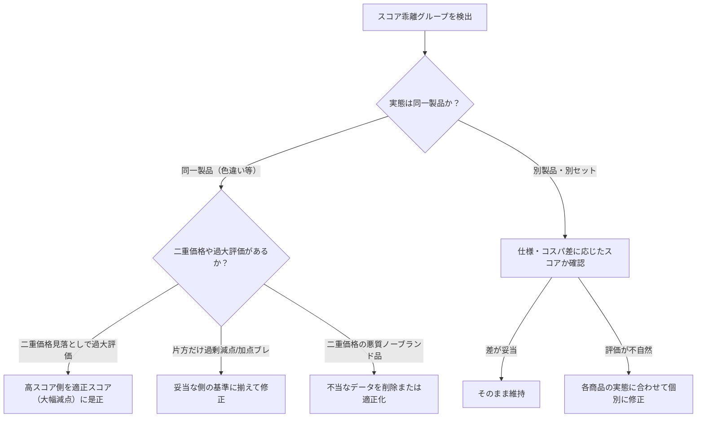

# 同一商品・バリエーション間スコア乖離 調査・是正ワークフロー

同一親ASIN（`parentAsin`）に属するバリエーション商品（カラー違い、サイズ・容量違いなど）において、調査データ間のスコアが大きく乖離しているものを検出し、原因の特定とスコアの適正化・データ整理を行う手順です。

## 1. 概要

- **スコア乖離の主な原因**:
  1. **同一製品における評価基準のブレ（要是正）**:
     同一モデルの色違い等であるにもかかわらず、一方では「二重価格（異常割引率）に対する減点（-20点）」が適用され、もう一方では見落とされてカタログスペック加点（+20点）が積み上がったケース。
  2. **親ASIN共有だが実態が別製品のケース（妥当な場合あり）**:
     Amazonのカタログ統合により、本体と付属品（例: レゴ本体と基礎板、スマホ本体とケース）が同一親ASINに紐付いているケース。
  3. **容量・セット内容の違いによるコスパ差（妥当な場合あり）**:
     大容量パックの方が単価が安くスコアが高くなっているケース。
- **対象ファイル**:
  - `data/investigations/<ASIN>.json`（調査レポート）
  - `content/articles/<ASIN>.md`（生成済み記事）
  - `data/cache/paapi-product-cache.json`（商品キャッシュ）

---

## 2. 監査手順 (Audit)

### 2.1 スコア乖離グループの一覧検出
全調査データから、同一親ASIN内でスコア差が一定以上あるグループを検出します。

```bash
# デフォルト（スコア差10点以上）を検出
pnpm run audit:score-discrepancy

# 乖離の大きいもの（例: 20点以上）を優先検出
pnpm ts-node scripts/find-score-discrepancy.ts --threshold 20
```

### 2.2 特定の親ASIN・ASINの詳細確認（採点根拠の表示）
採点根拠（`scoreRationale`）を含めて詳細を出力します。

```bash
# 親ASINを指定して詳細表示 (-v / --verbose)
pnpm ts-node scripts/find-score-discrepancy.ts --parent <親ASIN> -v

# 特定ASINの属するグループを確認
pnpm ts-node scripts/find-score-discrepancy.ts --asin <ASIN> -v
```

---

## 3. 調査・判断フロー (Decision Matrix)



### パターン別の対応基準

| パターン | 実態 | 推奨対応 |
|---|---|---|
| **A. 同一商品のカラー違い** | 型番・仕様・実売価格が完全同一 | **スコア・採点根拠を統一**。二重価格（70%〜90%オフ表示）がある場合は、二重価格ペナルティ（-15〜-20点）を適用した低スコア側に合わせる。 |
| **B. 虚偽スペック・二重価格の見落とし** | 実在しない「Bluetooth 6.0」やサクラ警告 | 虚偽スペックやサクラリスクを正しく見抜いて減点（-15〜-20点）している**適正な低スコア側に統一**（過大評価側を是正）。 |
| **C. 親ASIN共通の別製品** | 本体とアクセサリ、別モデル | それぞれの製品実態に即した評価になっているか確認。妥当な差であれば**維持**。 |
| **D. 容量・サイズ違い** | 100ml vs 500ml等 | 単価（容量あたり価格）の違いによる正当なコスパ差であれば**維持**。 |

---

## 4. 是正・修正手順 (Fix)

### 4.1 調査データ（JSON）の修正
`data/investigations/<ASIN>.json` の `recommendation` セクションを修正します。

```json
{
  "recommendation": {
    "score": 60,
    "scoreRationale": "[基本点: 70]\n[加点: +5] (理由)\n[減点: -15] (過去参考価格からの大幅割引表示による二重価格ペナルティ)\n[合計: 60]",
    "cons": [
      "過去参考価格からの大幅な割引率を表示しており、二重価格（見せ金）の疑いが強いため注意が必要"
    ]
  }
}
```

### 4.2 不要・不当データの削除
過大評価されたバリエーションデータを削除する場合：

```bash
# 1. 調査データの削除
rm data/investigations/<ASIN>.json

# 2. 記事が存在する場合は記事も削除
rm content/articles/<ASIN>.md

# 3. サイトインデックスの再構築
pnpm run prebuild:hugo
```

---

## 5. 検証手順 (Verification)

修正・整理完了後は、以下のコマンドで整合性を確認します。

```bash
# 1. アーティファクトの妥当性検証
uv run python scripts/validate_artifact.py data/investigations/<修正したASIN>.json

# 2. 構文・定義の検証
pnpm run biome:check

# 3. TypeScriptコンパイル
pnpm run build

# 4. 全ユニットテスト
pnpm test

# 5. スコア乖離の解消確認
pnpm ts-node scripts/find-score-discrepancy.ts --parent <親ASIN> -v
```
