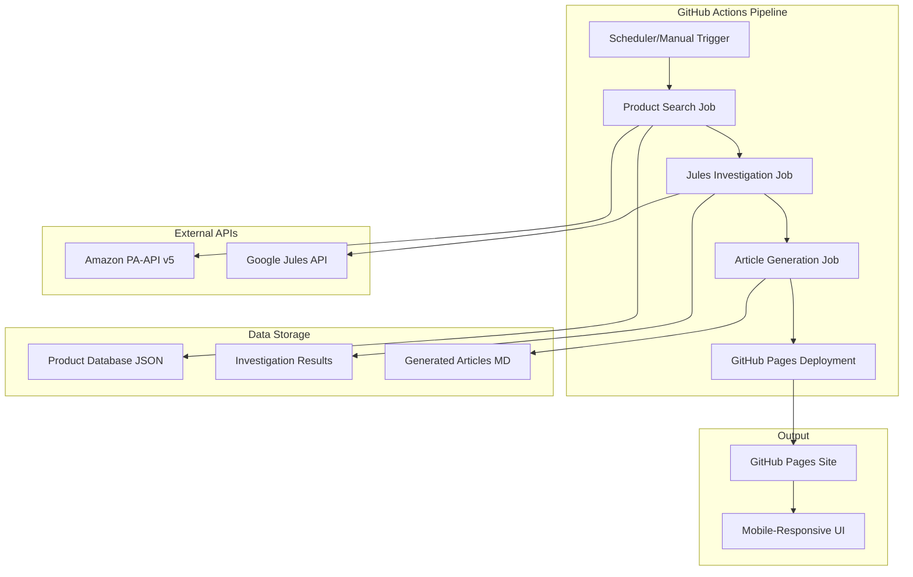
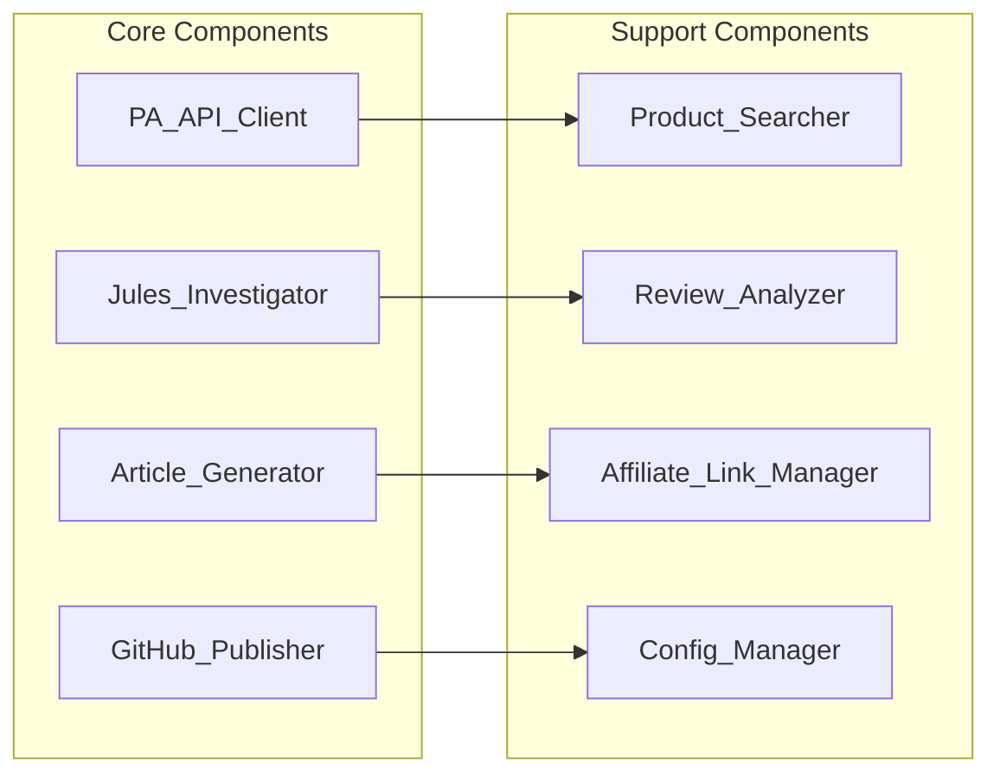

# Design Document: Amazon Product Research System

## Overview

Amazon PA-API v5とGoogle Jules APIを活用した商品調査記事の自動生成・公開システムの設計。GitHub Actionsによる自動化パイプラインを通じて、商品検索から詳細調査、記事生成、公開まで一貫したワークフローを提供する。モバイルファーストのレスポンシブデザインでユーザーの購買判断を支援し、アフィリエイト収益を通じて持続可能な運営を実現する。

## Architecture

### システム全体アーキテクチャ



### コンポーネント構成



## Components and Interfaces

### 1. PA_API_Client

**責任**: Amazon Product Advertising API v5との通信とデータ取得

**主要メソッド**:
```typescript
interface PA_API_Client {
  authenticate(accessKey: string, secretKey: string, partnerTag: string): Promise<void>
  searchProducts(category: string, keywords: string[], maxResults: number): Promise<Product[]>
  getProductDetails(asin: string): Promise<ProductDetail>
  handleRateLimit(): Promise<void>
}
```

**設定**:
- GitHub Actionsシークレットから認証情報を取得
- レート制限対応（1秒あたり1リクエスト）
- エラーハンドリングと再試行ロジック

### 2. Jules_Investigator

**責任**: Google Jules APIを使用した商品調査の実行

**主要メソッド**:
```typescript
interface Jules_Investigator {
  createSession(prompt: string, context: InvestigationContext): Promise<string>
  monitorSession(sessionId: string): Promise<SessionStatus>
  retrieveResults(sessionId: string): Promise<InvestigationResult>
  formatInvestigationPrompt(product: Product): string
}
```

**調査プロンプトテンプレート**:
```
商品「{product_name}」について以下の観点で詳細調査を実施してください：

1. ユーザーレビュー分析
   - 良い点：具体的な使用体験と満足ポイント
   - 悪い点：問題点と改善要望
   - 使用シーン：どのような場面で活用されているか

2. 競合商品との比較
   - 同カテゴリの主要競合商品3-5点
   - 価格、機能、品質の比較
   - 差別化ポイントの特定

3. 購買推奨度
   - どのようなユーザーに適しているか
   - 購入時の注意点
   - コストパフォーマンス評価

調査結果は構造化されたMarkdown形式で提供してください。
```

### 3. Article_Generator

**責任**: 調査結果からMarkdown記事の生成

**主要メソッド**:
```typescript
interface Article_Generator {
  generateArticle(product: Product, investigation: InvestigationResult): Promise<string>
  createMobileOptimizedLayout(content: string): string
  insertAffiliateLinks(content: string, asin: string): string
  generateSEOMetadata(product: Product): ArticleMetadata
}
```

**記事構造テンプレート**:
```markdown
---
title: "{product_name}の詳細レビュー：ユーザーの本音と競合比較"
description: "{product_name}の実際のユーザーレビューを分析し、競合商品との比較を通じて購買判断をサポート"
date: {generation_date}
category: {product_category}
tags: [商品レビュー, {category_tags}]
mobile_optimized: true
---

# {product_name}の詳細レビュー

## 商品概要
{product_overview}

## ユーザーの声：良い点
{positive_reviews}

## ユーザーの声：気になる点
{negative_reviews}

## 競合商品との比較
{competitive_analysis}

## 購入推奨度
{recommendation}

## 商品詳細・購入
{affiliate_links_section}

---
*本記事にはアフィリエイトリンクが含まれています。商品購入時に当サイトが収益を得る場合があります。*
```

### 6. Article_Quality_Manager

**責任**: 記事品質の管理とテンプレート制御

**主要メソッド**:
```typescript
interface Article_Quality_Manager {
  validateArticleStructure(article: string): ValidationResult
  generateQualityPrompt(product: Product, template: ArticleTemplate): string
  checkContentCompleteness(article: string): QualityScore
  enforceStyleGuidelines(content: string): string
}
```

**記事品質テンプレート**:
```typescript
interface ArticleTemplate {
  sections: {
    introduction: TemplateSection
    userReviews: TemplateSection
    competitiveAnalysis: TemplateSection
    recommendation: TemplateSection
    conclusion: TemplateSection
  }
  qualityRequirements: {
    minWordCount: number
    requiredElements: string[]
    styleGuidelines: StyleRule[]
  }
}
```

### 7. Auto_Merge_Manager

**責任**: Julesプルリクエストの条件付き自動マージ

**主要メソッド**:
```typescript
interface Auto_Merge_Manager {
  validatePullRequest(pr: PullRequest): MergeDecision
  checkFilePathRestrictions(changedFiles: string[]): boolean
  verifyJulesAuthor(pr: PullRequest): boolean
  executeMerge(prNumber: number): Promise<MergeResult>
}
```

**Jules記事作成プロンプトテンプレート**:
```
以下のテンプレートに従って、商品「{product_name}」の詳細レビュー記事を作成してください：

## 記事構造要件
1. **導入部** (200-300文字)
   - 商品の基本情報と記事の目的を明確に記載
   - 読者の関心を引く導入文

2. **ユーザーレビュー分析** (800-1200文字)
   - 良い点：具体的な使用体験3-5点
   - 気になる点：問題点と改善要望3-5点
   - 実際の使用シーンと効果

3. **競合商品との比較** (600-800文字)
   - 同カテゴリ主要競合商品2-3点との比較
   - 価格、機能、品質の客観的比較
   - 差別化ポイントの明確化

4. **購入推奨度** (400-600文字)
   - 推奨ユーザー層の特定
   - 購入時の注意点
   - コストパフォーマンス評価

## 品質要件
- 最低2000文字以上
- 客観的で公平な分析
- 具体的な根拠に基づく評価
- モバイル読者を意識した読みやすい構成
- SEOを意識したキーワード配置

## 出力形式
Markdown形式で、指定されたセクション構造に従って作成してください。
```

**自動マージ条件**:
```typescript
interface MergeConditions {
  allowedPaths: string[]        // ["articles/", "reviews/", "_posts/"]
  requiredAuthor: string        // "jules[bot]"
  requiredChecks: string[]      // ["quality-check", "format-validation"]
  excludedPaths: string[]       // [".github/", "config/", "_config.yml"]
}
```

### 9. Site_Navigation_Manager

**責任**: サイトナビゲーションとフィルタリング機能の管理

**主要メソッド**:
```typescript
interface Site_Navigation_Manager {
  generateCategoryIndex(articles: ArticleMetadata[]): CategoryIndex
  createFilterableInterface(categories: Category[], manufacturers: string[]): FilterInterface
  updateNavigationMenu(newArticle: ArticleMetadata): Promise<void>
  generateSitemap(): Promise<string>
}
```

**カテゴリ構造**:
```typescript
interface Category {
  id: string
  name: string
  description: string
  subcategories: Category[]
  articleCount: number
  featuredProducts: string[]
}

interface FilterInterface {
  categories: CategoryFilter[]
  manufacturers: ManufacturerFilter[]
  priceRanges: PriceRangeFilter[]
  ratings: RatingFilter[]
  keywords: KeywordFilter
}
```

**フロントマター構造**:
```yaml
---
title: "商品名の詳細レビュー"
description: "商品の詳細分析と競合比較"
date: 2025-01-01
category: "electronics"
subcategory: "smartphones"
manufacturer: "Apple"
asin: "B08N5WRWNW"
price_range: "high"
rating: 4.5
tags: ["スマートフォン", "iPhone", "高性能"]
keywords: ["iPhone", "レビュー", "比較"]
featured: true
mobile_optimized: true
---
```

### 10. GitHub_Publisher

**責任**: GitHub Pagesへの記事公開とサイト管理

**主要メソッド**:
```typescript
interface GitHub_Publisher {
  commitArticle(article: string, metadata: ArticleMetadata): Promise<void>
  updateSiteIndex(newArticle: ArticleMetadata): Promise<void>
  deployToPages(): Promise<void>
  generateMobileCSS(): string
  updateCategoryPages(category: string): Promise<void>
  generateFilterableIndex(): Promise<void>
}
```

**サイト構造**:
```
/
├── index.html                 # メインページ（カテゴリ一覧）
├── categories/
│   ├── electronics/
│   │   ├── index.html        # エレクトロニクスカテゴリページ
│   │   ├── smartphones/      # サブカテゴリ
│   │   └── laptops/
│   └── home-garden/
├── manufacturers/
│   ├── apple/
│   ├── sony/
│   └── index.html            # メーカー一覧
├── articles/
│   ├── product-asin-123.md   # 個別商品記事
│   └── product-asin-456.md
└── assets/
    ├── css/
    ├── js/
    └── images/
```

## Data Models

### Product
```typescript
interface Product {
  asin: string
  title: string
  category: string
  price: {
    amount: number
    currency: string
    formatted: string
  }
  images: {
    primary: string
    thumbnails: string[]
  }
  specifications: Record<string, string>
  availability: string
  rating: {
    average: number
    count: number
  }
}
```

### InvestigationResult
```typescript
interface InvestigationResult {
  sessionId: string
  product: Product
  analysis: {
    positivePoints: string[]
    negativePoints: string[]
    useCases: string[]
    competitiveAnalysis: CompetitiveProduct[]
    recommendation: {
      targetUsers: string[]
      pros: string[]
      cons: string[]
      score: number
    }
  }
  generatedAt: Date
}
```

### CompetitiveProduct
```typescript
interface CompetitiveProduct {
  name: string
  asin?: string
  priceComparison: string
  featureComparison: string[]
  differentiators: string[]
}
```

### ArticleTemplate
```typescript
interface ArticleTemplate {
  sections: {
    introduction: TemplateSection
    userReviews: TemplateSection
    competitiveAnalysis: TemplateSection
    recommendation: TemplateSection
    conclusion: TemplateSection
  }
  qualityRequirements: {
    minWordCount: number
    requiredElements: string[]
    styleGuidelines: StyleRule[]
  }
}

interface TemplateSection {
  title: string
  minWordCount: number
  requiredElements: string[]
  structure: string
}
```

### MergeDecision
```typescript
interface MergeDecision {
  shouldMerge: boolean
  reason: string
  validationResults: ValidationResult[]
  pathCheck: boolean
  authorCheck: boolean
}
```

### QualityScore
```typescript
interface QualityScore {
  overall: number
  completeness: number
  structure: number
  readability: number
  seoOptimization: number
  issues: QualityIssue[]
}
```

### CategoryIndex
```typescript
interface CategoryIndex {
  categories: Category[]
  totalArticles: number
  lastUpdated: Date
  featuredArticles: ArticleMetadata[]
}
```

### FilterInterface Components
```typescript
interface CategoryFilter {
  category: string
  count: number
  subcategories: SubcategoryFilter[]
}

interface ManufacturerFilter {
  name: string
  count: number
  categories: string[]
}

interface PriceRangeFilter {
  range: string
  min: number
  max: number
  count: number
}
```

### ArticleMetadata
```typescript
interface ArticleMetadata {
  title: string
  description: string
  category: string
  subcategory?: string
  manufacturer?: string
  tags: string[]
  publishDate: Date
  asin: string
  priceRange: string
  rating?: number
  featured: boolean
  mobileOptimized: boolean
  seoKeywords: string[]
}
```

## Correctness Properties

*A property is a characteristic or behavior that should hold true across all valid executions of a system-essentially, a formal statement about what the system should do. Properties serve as the bridge between human-readable specifications and machine-verifiable correctness guarantees.*

### Property 1: Secure Authentication and Credential Management
*For any* API authentication request, the system should successfully authenticate with valid credentials and fail securely with invalid credentials, while never exposing sensitive information in logs or outputs.
**Validates: Requirements 1.1, 4.3**

### Property 2: Product Search and Data Extraction Completeness
*For any* valid product category search, the system should return products with all required fields (ASIN, title, price, specifications) properly extracted and stored in the expected structured format.
**Validates: Requirements 1.2, 1.3, 1.5**

### Property 3: Comprehensive Error Handling and Retry Logic
*For any* API failure scenario (rate limits, network errors, service unavailable), the system should implement appropriate retry strategies with exponential backoff and detailed error logging.
**Validates: Requirements 1.4, 2.5, 6.1, 6.2**

### Property 4: Jules Investigation Request Formatting
*For any* product investigation request, the generated prompt should contain all required elements (user review analysis instructions, competitive comparison requirements, market positioning focus) in the proper structured format.
**Validates: Requirements 2.1, 2.2, 2.4**

### Property 5: Investigation Result Processing Completeness
*For any* Jules investigation response, the system should successfully extract all required analysis components (pros/cons, competitive insights, user experiences) and structure them for article generation.
**Validates: Requirements 2.3, 5.3**

### Property 6: Article Structure and Content Completeness
*For any* investigation result, the generated Markdown article should include all required sections (product overview, user feedback analysis, pros/cons, competitive comparison) with proper SEO metadata and mobile-optimized formatting.
**Validates: Requirements 3.1, 3.2, 3.4, 3.5**

### Property 7: Review Analysis and Categorization Accuracy
*For any* set of user reviews, the Review_Analyzer should correctly categorize feedback into positive and negative points while extracting specific user experiences for comparative analysis.
**Validates: Requirements 3.3, 5.3**

### Property 8: Workflow Pipeline Execution Integrity
*For any* GitHub Actions workflow trigger, all pipeline steps (search, investigation, generation, publication) should execute in the correct order and complete successfully, with proper branch management and Pages deployment.
**Validates: Requirements 4.1, 4.2, 4.4, 4.5**

### Property 9: Competitive Analysis Completeness
*For any* product analysis, the system should identify relevant competing products and generate feature-by-feature comparisons with clear differentiators based on factual user feedback and specifications.
**Validates: Requirements 5.1, 5.2, 5.4, 5.5**

### Property 10: Comprehensive System Logging
*For any* major system operation (search, investigation, publishing), detailed logs should be generated with appropriate error notifications sent through GitHub Actions status updates when critical errors occur.
**Validates: Requirements 6.3, 6.4**

### Property 11: Content Quality Validation
*For any* generated content, the system should validate it against quality standards before publication, ensuring all content meets the established criteria.
**Validates: Requirements 6.5**

### Property 12: Configuration Management and Validation
*For any* system configuration change (categories, templates, schedules), the system should validate the new settings and provide clear error messages for invalid configurations while applying valid changes correctly.
**Validates: Requirements 7.1, 7.2, 7.3, 7.4, 7.5**

### Property 13: Affiliate Link Generation and Compliance
*For any* product, the system should generate properly formatted Amazon affiliate links with correct tracking parameters and validate them against Amazon Associates requirements.
**Validates: Requirements 8.1, 8.3, 8.5**

### Property 14: Legal Disclosure Compliance
*For any* generated article or site page, affiliate disclosure statements should be included as required by law, ensuring transparency about affiliate relationships.
**Validates: Requirements 8.2, 8.4**

### Property 15: Mobile-First Responsive Design Implementation
*For any* generated page or article, the content should be optimized for mobile-first responsive design with easily tappable interactive elements and mobile-friendly layouts that maintain desktop compatibility.
**Validates: Requirements 9.1, 9.2, 9.3, 9.4**

## Error Handling

### API Error Management
- **PA-API v5エラー**: レート制限、認証失敗、無効なASINに対する適切なエラーレスポンス
- **Jules APIエラー**: セッション作成失敗、調査タイムアウト、結果取得エラーの処理
- **GitHub APIエラー**: コミット失敗、Pages デプロイメントエラーの対応

### Retry Strategy
```typescript
interface RetryConfig {
  maxRetries: number
  baseDelay: number
  maxDelay: number
  backoffMultiplier: number
}

const defaultRetryConfig: RetryConfig = {
  maxRetries: 3,
  baseDelay: 1000,
  maxDelay: 30000,
  backoffMultiplier: 2
}
```

### Error Logging
- 構造化ログ形式でのエラー記録
- GitHub Actions ステータス更新による通知
- 重要度レベル別のエラー分類

## Testing Strategy

### Dual Testing Approach
システムの正確性を保証するため、単体テストとプロパティベーステストの両方を実装します：

**Unit Tests**:
- 特定の例とエッジケースの検証
- コンポーネント間の統合ポイントのテスト
- エラー条件と境界値のテスト

**Property-Based Tests**:
- 全入力に対する普遍的プロパティの検証
- ランダム化による包括的な入力カバレッジ
- 設計書のプロパティとの1対1対応

### Property-Based Testing Configuration
- **最小実行回数**: 各プロパティテストで100回の反復実行
- **テストライブラリ**: TypeScript環境でfast-checkを使用
- **タグ形式**: `**Feature: amazon-product-research-system, Property {number}: {property_text}**`

### Testing Framework Selection
- **Unit Testing**: Jest with TypeScript support
- **Property-Based Testing**: fast-check for comprehensive input generation
- **Integration Testing**: GitHub Actions workflow testing with act
- **End-to-End Testing**: Playwright for mobile-responsive UI validation

### Test Data Management
- モックデータ生成器による一貫したテストデータ
- PA-API v5レスポンスのモック化
- Jules API調査結果のサンプルデータセット