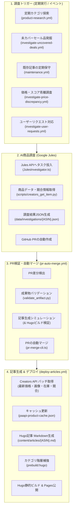

# 自動記事更新・生成システムの仕組み

本ドキュメントでは、Amazon Creators API と Google Jules（AIエージェント）を連携させ、商品の選定からAI調査、プルリクエスト（PR）の検証・自動マージ、記事生成、そしてGitHub Pagesへの公開・定期保守に至る**自律型記事更新パイプライン**の全体像と詳細仕様を解説する。

---

## 1. システム全体概要

本プラットフォームは、人手を介さずに常に最新の価格・在庫・客観的レビュー情報を維持できるよう、GitHub Actions を中核とした完全自動化サイクルを採用している。

### 全体アーキテクチャフロー

---

## 2. 記事更新の起点（5つの自動トリガー）

システムは単に新規記事を追加するだけでなく、**既存記事の陳腐化防止**や**セール品・価格変動への追従**を目的とした複数のワークフローを定期実行している。

| ワークフロー | 実行タイミング | 役割と対象選定ロジック |
|---|---|---|
| **`product-research.yml`** | 毎日 16:00 JST | 各種カテゴリ（家電、日用品、コスメ等）のキーワード検索を実行し、注目の未調査商品を抽出して調査を依頼する。 |
| **`investigate-uncovered-deals.yml`** | 毎日 11:00 JST | 現在セール対象となっている商品のうち、まだ調査記事が存在しないもの、または古い記事を優先的に検出して調査を依頼する。 |
| **`maintenance.yml`** | 毎日 05:00 JST | 最も過去に調査された古い記事（`maintenance-find-oldest.ts`）を特定し、最新情報にリフレッシュするための再調査を実施する。 |
| **`investigate-price-discrepancy.yml`** | 手動 / スケジュール | 同一商品のバリエーション間（カラー・サイズ違い等）で価格や評価スコアの乖離が発生している商品を検知し、再調査を依頼する。 |
| **`investigate-user-requests.yml`** | 定期 / イベント | 読者から寄せられた調査リクエスト（Google Forms / GAS連携）をキューから取り出し、自動調査に投入する。 |

---

## 3. 各フェーズの詳細動作

### 3.1 AI調査フェーズ（Google Jules）

1. **セッション投入**:
   - トリガーワークフローから `src/scripts/jules-investigation-cli.ts` が起動される。
   - `src/jules/JulesInvestigator.ts` が調査プロンプトを組み立て、Google Jules API にタスクを送信する。
2. **自律的データ収集**:
   - Jules は仮想環境内で `scripts/creators_get_item.py` や `scripts/creators_search_items.py` を実行し、Creators API から商品の正確な公式スペック、画像、価格、特徴を取得する。
   - レビュー情報、競合商品（3〜5製品）の比較データ、メリット・デメリット、想定ターゲット層を多角的に分析する。
3. **調査レポートPRの作成**:
   - 調査成果物を `data/investigations/{ASIN}.json` としてリポジトリの新規ブランチに保存し、GitHub Pull Request を自律的に作成する。

### 3.2 検証・自動マージフェーズ（`pr-auto-merge.yml`）

Julesが作成したPRは、無条件にマージされるのではなく、厳格な品質・安全検証を通過した場合にのみマージされる。

1. **差分解析**:
   - `gh pr diff` を使用して変更された調査ファイル（`data/investigations/*.json`）を特定する。
2. **アーティファクトの妥当性検証**:
   - Pythonスクリプト `scripts/validate_artifact.py` を実行する。
   - **スキーマ構造**: 必須フィールドの欠落がないか（Zod/Pydantic相当の検証）。
   - **非メートル法の排除**: インチ、ポンド、オンスなどの不適切な単位表記が含まれていないか。
   - **リンク検証**: 記載された参照元URLが有効か（リンク切れ、Soft-404の排除）。
3. **記事生成・ビルドのドライラン（シミュレーション）**:
   - `article-generation-cli.ts --skip-paapi` を実行し、Markdown記事の生成処理が例外なく完了するかテストする。
   - `pnpm run prebuild:hugo` および `hugo --minify` による静的サイトビルドが正常にパスすることを確認する。
4. **自動マージ実行**:
   - 全ての検証をパスした場合、`src/scripts/pr-merge-cli.ts` がPRを自動マージする。
   - マージ完了後、後続のデプロイワークフロー（`deploy-articles.yml`）をトリガーする。

### 3.3 記事生成 & デプロイフェーズ（`deploy-articles.yml`）

PRが `main` ブランチにマージされると、公開用パイプラインが実行される。

1. **最新商品データのバッチ取得（`pnpm run generate:articles`）**:
   - `src/scripts/article-generation-cli.ts` が `data/investigations/` 配下の全JSON（または差分対象）を読み込む。
   - 主商品および競合商品のASINを抽出し、Amazon Creators API v1 を通じて最新の価格、ポイント還元、画像URL、在庫状況、セール情報を一括取得する。
   - レートリミット（0.8 req/sec）を遵守しつつ、APIレスポンスを `data/cache/paapi-product-cache.json` に保存・更新する。
2. **Markdown記事の生成（`ArticleGenerator.ts`）**:
   - **初回公開日（date）の保護**: 既存記事（`content/articles/{ASIN}.md`）が存在する場合はその初出日時を維持し、SEO評価やURLパーマリンクの永続性を確保する。
   - **Front matter の構築**: タイトル、カテゴリ、タグ、価格、評価スコア、割引情報、M3バッジ種別をメタデータとして設定する。
   - **本文の構成**:
     - ヒーローセクション（主要スペック、最新価格、アフィリエイトリンク）
     - 長所（Pros）と短所（Cons）の整理
     - 競合商品との徹底比較表
     - 実際の利用シーンとおすすめの読者像
     - 調査の根拠（一次情報ソース一覧）
3. **カテゴリ・ナビゲーションの同期（`pnpm run prebuild:hugo`）**:
   - `data/categorygroups.json` および記事のFront matterをスキャンし、親子カテゴリ構造（`data/categories.yml`）とブランドマッピングを生成する。
4. **キャッシュの永続化**:
   - ビルド中に更新された最新の商品情報キャッシュ（`paapi-product-cache.json`）をGitコミット・プッシュ（`[skip ci]`）し、次回ビルドの高速化を図る。
5. **Hugoビルド & GitHub Pagesデプロイ**:
   - `hugo --minify` でHTML/CSS/JSを静的コンパイルする。
   - `actions/deploy-pages` によりGitHub Pagesへ即時配信される。

---

## 4. 品質維持とフェイルセーフの仕組み

本システムが安定して長期運用されるために、以下の安全機構が組み込まれている。

### 4.1 取扱終了（デッド）商品の自動検出・棚卸し
- Amazon上で販売終了やページ削除となった商品（Creators APIで恒久的に取得不能な商品）は、`src/scripts/maintenance/prune-dead-products.ts` により監査される。
- デッド商品は一覧表示から除外され、サイト全体のリンク切れや品質低下を防止する。

### 4.2 レートリミット制御とリトライ耐性
- Amazon Creators API 通信部（`src/api/CreatorsAPIClient.ts`）には、トークンバケットアルゴリズムによる流量制御が組み込まれている。
- 一時的な 429（Too Many Requests）や 5xx エラーが発生した場合は、指数バックオフ（Exponential Backoff）による自動リトライを実行する。

### 4.3 キャッシュの2層構造
- **本番環境**: `data/cache/paapi-product-cache.json` に約56MB相当のAPIキャッシュを保持し、ビルド時間とAPI消費量を最小限に抑える。
- **開発環境**: `hugo.dev.toml` により軽量ダミーキャッシュ（`data/cache/paapi-product-cache.dev.json`）をマウントし、ローカル開発時のメモリ消費と起動時間を短縮する。

### 4.4 セキュリティ・機密情報の保護
- Creators API の秘密鍵（`AMAZON_CREATORS_CREDENTIAL_SECRET`）や Jules APIキーは、GitHub Secrets および環境変数でのみ管理される。
- コンソールログやコミットメッセージ、生成記事本文への秘密情報の露出は徹底して排除されている。

### 4.5 複数PR同時マージ時のキャッシュ競合自動解決
- Julesなどから短時間で複数のPRが連続マージされた場合、並行・後続するデプロイワークフローにおいて `data/cache/paapi-product-cache.json` のGit競合が発生する可能性がある。
- システムは `.github/workflows/scripts/git-commit-push.sh` のリトライループ内で競合を検知し、`src/scripts/maintenance/merge-product-cache.ts` を用いてASIN単位でタイムスタンプを比較・最新エントリをマージする。
- これにより、人の介入なしにコンフリクトを完全自動解消し、キャッシュデータの消失やビルド失敗を防止する。

---

## 5. 関連ファイル一覧

| ファイル | 役割 |
|---|---|
| `.github/workflows/deploy-articles.yml` | 記事生成・サイトビルド・デプロイのメインパイプライン |
| `.github/workflows/pr-auto-merge.yml` | Jules PRの自動検証・シミュレーション・自動マージ |
| `.github/workflows/product-research.yml` | 定期的な商品探索とJules調査依頼 |
| `.github/workflows/maintenance.yml` | 最古記事の定期リフレッシュワークフロー |
| `.github/workflows/scripts/git-commit-push.sh` | ビルド成果物・キャッシュの安全なプッシュ・リトライ・競合解消シェル |
| `src/scripts/maintenance/merge-product-cache.ts` | Git競合時にキャッシュJSONをタイムスタンプベースで自動統合するマージスクリプト |
| `src/scripts/article-generation-cli.ts` | 調査JSONからMarkdown記事を生成するCLI本体 |
| `src/article/ArticleGenerator.ts` | 記事のマークダウン構造・Front matterを組み立てるロジック |
| `src/api/CreatorsAPIClient.ts` | Creators API v1 とのセキュアな通信クライアント |
| `src/api/CreatorsAPICache.ts` | 商品情報キャッシュの保存・期限管理・無効ASIN判定 |
| `scripts/validate_artifact.py` | 調査JSONのスキーマ、単位、URLリンクの自動検証スクリプト |
