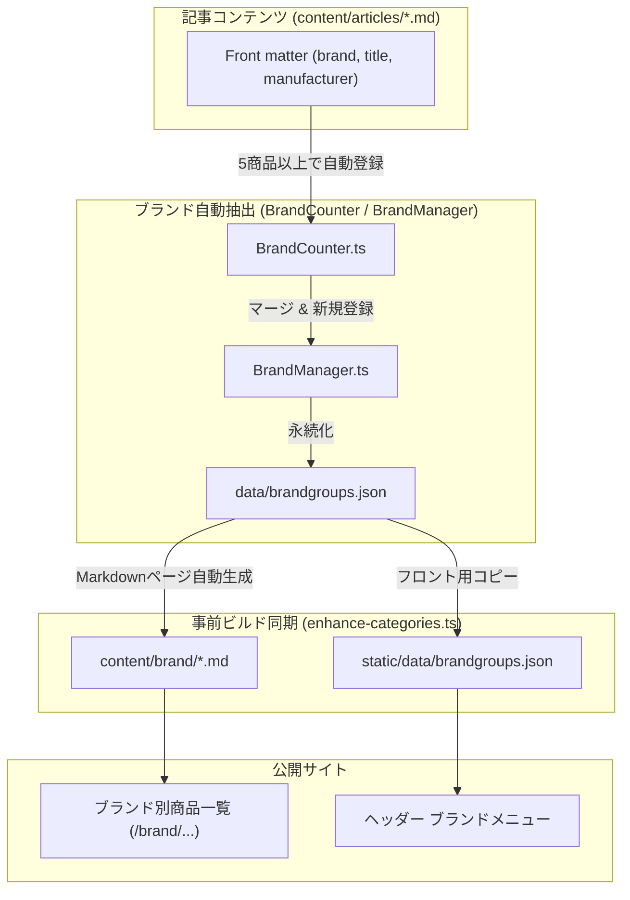

# ブランド管理システム仕様書

本ドキュメントでは、本システムにおけるブランド情報の定義構造、マッチャーによる商品紐付け、自動抽出・同期処理、およびブランド別一覧ページの自動生成の仕組みについて解説する。

---

## 1. ブランド管理の概要とデータフロー

本システムでは、記事データから一定数以上の商品を持つ主要ブランドを自動抽出し、専用のブランド一覧ページ（`/brand/<slug>/`）やブランド別ドロップダウンメニューを提供する。



### 1.1 データソースと生成成果物

| ファイル / ディレクトリ | 役割 | 管理形態 |
|---|---|:---:|
| `data/brandgroups.json` | ブランドの定義（スラッグ、マッチャー、説明文等） | 自動抽出 ＋ 手動調整 |
| `static/data/brandgroups.json` | クライアント側JSで参照される動的メニュー用データ | 自動同期（`prebuild:hugo`） |
| `content/brand/*.md` | ブランド別のHugo一覧用Markdownページ | 自動生成（`prebuild:hugo`） |

---

## 2. ブランド定義の構造（`data/brandgroups.json`）

各ブランドは、以下のスキーマに従って `data/brandgroups.json` 内に定義される。

```json
{
  "Anker": {
    "slug": "anker",
    "description": "充電器やモバイルバッテリー、オーディオ製品で高い信頼を得るブランド",
    "matcher": {
      "type": "title_prefix",
      "value": "Anker|アンカー"
    }
  },
  "LUX": {
    "slug": "lux",
    "description": "トータルヘアケアブランド",
    "matcher": {
      "type": "title_prefix",
      "value": "\\bLUX\\b|ラックス"
    }
  }
}
```

### 2.1 マッチャー種別 (`matcher.type`)

| マッチャー種別 | 判定対象 | 説明 |
|---|---|---|
| **`title_prefix`** (推奨/デフォルト) | タイトル | 商品タイトルの先頭部分にブランド名または別名（正規表現）が含まれるか判定 |
| **`brand`** | `brand` フィールド | Front matter の `brand` フィールドと完全一致（または正規表現一致）で判定 |
| **`regex`** | タイトル全域 | タイトル全体のどこかに特定パターンが含まれるかを判定 |

---

## 3. 編集規約と誤判定防止策

`data/brandgroups.json` を手動で編集・調整する際は、ブランド判定の誤爆を防ぐため以下のルールを厳守すること。

### 3.1 単語境界（`\b`）の活用（重要）

アルファベット数文字の短いブランド名は、他社ブランド名や英単語の一部に部分一致して誤判定（フォールス・ポジティブ）を引き起こしやすい。
そのため、短いアルファベットを含むマッチャーには必ず単語境界 `\b`（JSON内ではエスケープして `\\b`）を指定しなければならない。

- **誤判定の典型例**:
  - `LUX` が `NIPLUX`（美容家電）に誤ヒットする。
  - `CIO` が `ELGATO` や単語 `delicious` 等に誤ヒットする。
  - `LG` が `Logitech` や型番 `LG-xxxx` 以外に誤ヒットする。
  - `ASUS` が `abrAsus`（薄い財布）に誤ヒットする。
  - `PLUS` が `Vacplus` に誤ヒットする。
- **正しい設定例**:
  - `"value": "\\bLUX\\b|ラックス"`
  - `"value": "\\bCIO\\b"`
  - `"value": "\\bLG\\b"`
  - `"value": "\\bASUS\\b|エイスース"`

### 3.2 親ブランドとサブブランドの区別

同一企業内で「親ブランド」と「サブブランド」が独立したブランドページを持つ場合（例: `Amazon` と `Amazonベーシック` や `by Amazon`）：

- 親ブランド（`Amazon`）のマッチャーは `type: "brand"` かつ完全一致 `^Amazon$` で定義する。
- これにより、サブブランドの商品が親ブランドの一覧に重複混入することを防止する。

---

## 4. 自動同期・更新の手順

ブランド定義を変更した後は、必ず事前ビルド同期を実行して静的ファイルおよびMarkdownページを更新する。

```bash
# 1. JSON構文チェック
pnpm run biome:check

# 2. ブランドデータの同期とページ生成
pnpm run prebuild:hugo
```

実行後、`content/brand/` 配下に新しいMarkdownファイルが生成され、不要になったファイルは自動削除される。
