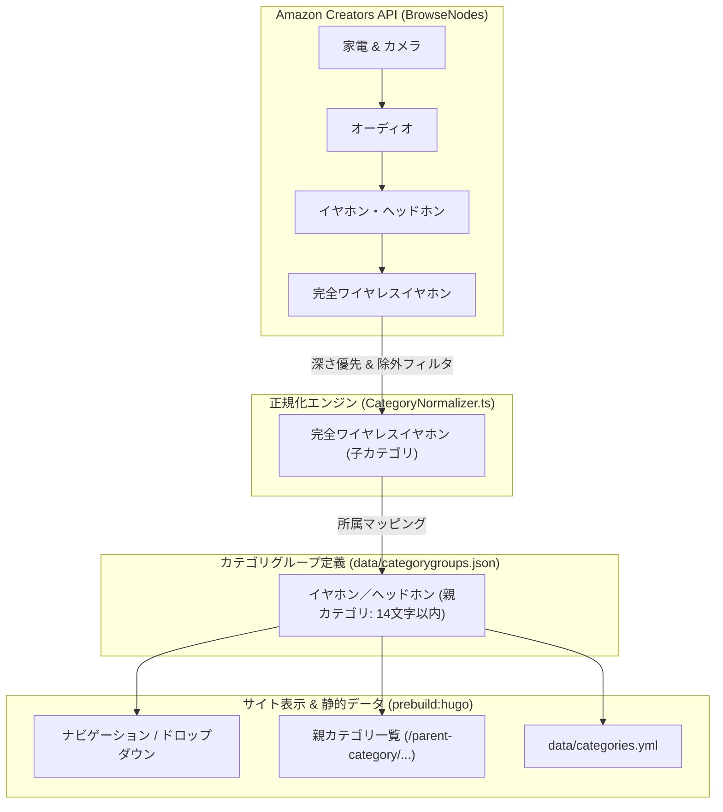
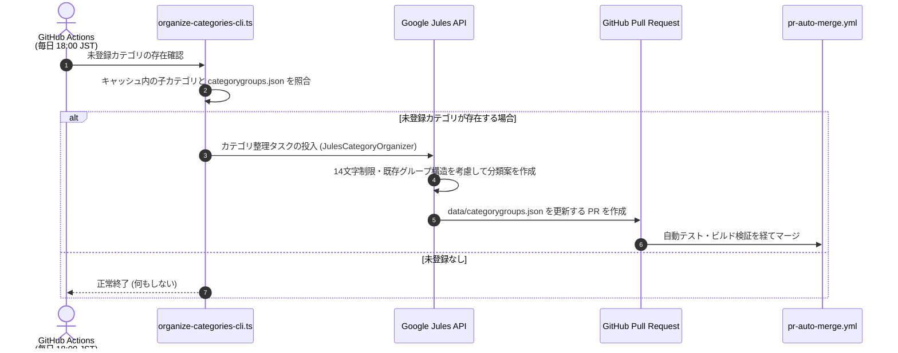

# カテゴリ管理・整理システム仕様書

本ドキュメントでは、本システムにおける商品カテゴリの階層構造、正規化アルゴリズム、AI（Google Jules）を活用した自動整理ワークフロー、親カテゴリの命名規約、およびトラブルシューティング手順を体系的に解説する。

---

## 1. カテゴリシステムの構造

本プラットフォームのカテゴリは、Amazon Creators API から取得される詳細な商品分類（子カテゴリ）と、サイトナビゲーション用に集約された「親カテゴリ（カテゴリグループ）」の2層構造で管理されている。



### 1.1 データソースファイル

| ファイル | 役割 | 管理形態 |
|---|---|:---:|
| `data/categorygroups.json` | 親カテゴリと所属する子カテゴリ（配列）のマッピング定義 | 手動管理 / AI自動更新 |
| `data/categories.yml` | 記事数集計やスラッグ等が付加されたHugo用カテゴリ階層データ | 自動生成（`prebuild:hugo`） |
| `static/data/categorygroups.json` | フロントエンド（ドロップダウンメニュー等）で動的読み込みされるデータ | 自動同期（`prebuild:hugo`） |
| `content/parent-category/*.md` | 親カテゴリごとの一覧表示用Markdownページ | 自動同期（`prebuild:hugo`） |

---

## 2. 親カテゴリ管理の必須規約

`data/categorygroups.json` を編集（新規追加、名称変更、所属変更）する際は、サイトUIの整合性を保つため以下のルールを厳格に遵守しなければならない。

### 2.1 命名規則と文字数制限（14文字以内・厳守）

- **文字数上限**: **親カテゴリ名は必ず14文字以内（15文字以上は禁止）** とする。
  - スマートフォン表示、ヘッダードロップダウンメニュー、ホーム画面一覧等での改行崩れ・文字見切れを防止するためである。
- **命名スタイル**: 複数ジャンルを並記する場合も、スラッシュ（`／`）を含めて14文字以内に収まるよう簡潔に命名する。
  - ◯ 良い例: `スマートウォッチ／活動量計` (13文字)、`イヤホン／ヘッドホン` (10文字)、`文房具／オフィス用品` (10文字)
  - ✕ 悪い例: `スマートウォッチ・ヘルスケア・活動量計` (21文字 - 禁止)

### 2.2 ソート順（Unicodeコードポイント順）

親カテゴリ定義内の子カテゴリ一覧は、常にUnicodeコードポイント順（英数字 > ひらがな > カタカナ > 漢字）で整列されている必要がある。手動編集後は必ず以下のコマンドを実行する：

```bash
pnpm run sort:categories
```

### 2.3 構文検証と事前ビルド同期

編集完了後は、以下の検証と同期処理を順に実行する：

```bash
# 1. JSON構文エラーのチェック
pnpm run biome:check

# 2. categories.yml および parent-category/*.md の自動同期
pnpm run prebuild:hugo
```

---

## 3. AIによるカテゴリ自動整理ワークフロー

新規商品が調査されると、`data/categorygroups.json` に未登録の新しい子カテゴリが追加される場合がある。これらは一時的に「その他／全般」に分類されるが、GitHub Actions により自動で適切な親カテゴリへ整理される。

### 3.1 自動整理サイクル（`organize-categories.yml`）



1. **未登録カテゴリの検出**:
   - `data/cache/paapi-product-cache.json` に存在するカテゴリと、`data/categorygroups.json` の登録カテゴリを照合する。
2. **Jules セッションの開始**:
   - 未登録カテゴリがある場合、`src/scripts/organize-categories-cli.ts` を通じて Google Jules に整理セッションを投入する。
   - Jules は親カテゴリの「14文字以内ルール」と既存の分類体系を学習した上で、最適な親カテゴリへの割り当て（または新規親カテゴリの策定）を行う。
3. **PR作成とマージ**:
   - Jules が更新後の `data/categorygroups.json` を含めた PR を自律的に作成し、`pr-auto-merge.yml` によって自動マージされる。

---

## 4. 商品カテゴリ正規化エンジン（`CategoryNormalizer.ts`）

Amazon Creators API は、商品に対して複数のカテゴリ階層（BrowseNodes）を返却する。本システムの `src/utils/CategoryNormalizer.ts` は、その中から最も適切で具体的なカテゴリ名を1つ選出する。

### 4.1 選定アルゴリズムの優先順位ポリシー

最適なカテゴリは、以下の優先順位に従って厳格に決定される：

```text
1. カテゴリ階層の深さ (Depth / nameCount) 【最優先】
   └ 最も具体的（深い）な末端ノードを最優先する。
      (例: 「家電」よりも「生活家電 > 掃除機 > ロボット掃除機」を優先)

2. キーワードスコア (Score)
   └ 深さが同等の場合、preferredKeywords（家電、ベビー、玩具等）に合致するドメインを優先。

3. 売上順位 (SalesRank)
   └ 深さもスコアも同等の場合、Amazon上での売上順位が高いノードを優先。
```

### 4.2 ジャンクカテゴリの除外フィルタ設計

Creators API のレスポンスには、キャンペーン用や社内管理用の不要なノードが混入することがある。これらは正規化エンジンで除外される。

- **`blacklist`（完全一致除外）**:
  - `パントリー`, `定期おトク便`, `タイムセール` 等のサービス名・企画名。
- **`invalidPatterns`（正規表現による除外）**:
  - キャンペーン・動的文字列: `/hpcafc\d*under/i`, `/^hpc/i`
  - ブランド名混入ノード: 特定ブランドの特設ストア用ノード
  - 記号・無効文字: スラッシュ連続や記号混入

---

## 5. 手動修正とトラブルシューティング

特定の商品が意図しないカテゴリ（「その他」やジャンクカテゴリ）に分類されている場合の調査・修正手順である。

### 5.1 原因調査ステップ

1. **キャッシュ内の該当カテゴリ確認**:
   ```bash
   # キャッシュ内のカテゴリ表記を検索
   grep "対象キーワード" data/cache/paapi-product-cache.json
   ```

2. **Amazon API 生データの取得**:
   ```bash
   uv run python scripts/debug_dump.py <ASIN>
   ```
   実行後、`tmp/debug_output.json` に出力される生 BrowseNode 情報を確認する。

3. **正規化プロセスの詳細トレース**:
   ```bash
   npx ts-node tmp/repro_issue.ts <ASIN>
   ```
   各ノードの `Depth`, `Score`, `SalesRank` の競合状態をログで確認する。

### 5.2 テスト駆動によるロジック修正 (TDD)

1. **テストケースの追加**:
   `src/utils/CategoryNormalizer.test.ts` に不適切なカテゴリが `false` を返すテストを追加する。
   ```typescript
   it('should return false for junk category', () => {
     expect(CategoryNormalizer.isValidCategoryName('ジャンクカテゴリ名')).toBe(false);
   });
   ```

2. **ロジックの修正**:
   `src/utils/CategoryNormalizer.ts` の `blacklist` または `invalidPatterns` を更新する。

3. **テスト実行**:
   ```bash
   pnpm test src/utils/CategoryNormalizer.test.ts
   ```

### 5.3 キャッシュのリセットと再生成

ロジックを修正した後は、既存のAPIキャッシュをリセットして再取得させる必要がある。

- **キーワード指定による一括リセット**:
  ```bash
  npx ts-node scripts/reset-category-cache.ts "リセット対象のカテゴリ名"
  ```
- **ASIN指定による個別リセット**:
  ```bash
  npx ts-node scripts/reset-cache-timestamp.ts <ASIN>
  ```
- **記事の再生成と反映確認**:
  ```bash
  pnpm run generate:articles -- --asin <ASIN>
  ```
  `content/articles/<ASIN>.md` のフロントマター（`categories`, `subcategory`）が正しく修正されているか確認する。

---

## 6. カテゴリ関連コマンド一覧

| コマンド | 役割 |
|---|---|
| `pnpm run organize:categories` | 未登録カテゴリを検出し、Julesによる自動分類セッションを開始する |
| `pnpm run sort:categories` | `data/categorygroups.json` の子カテゴリをUnicode順にソートする |
| `pnpm run prebuild:hugo` | カテゴリ階層を拡張し、`categories.yml` や親カテゴリMarkdownを同期する |
| `pnpm run biome:check` | `data/categorygroups.json` を含む定義JSONの構文妥当性を検証する |
| `npx ts-node scripts/reset-category-cache.ts "<ワード>"` | 指定したカテゴリ名を含む商品のキャッシュタイムスタンプをリセットする |
