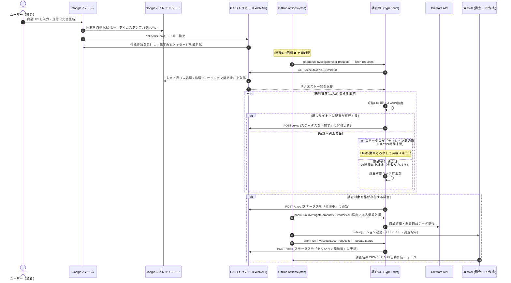
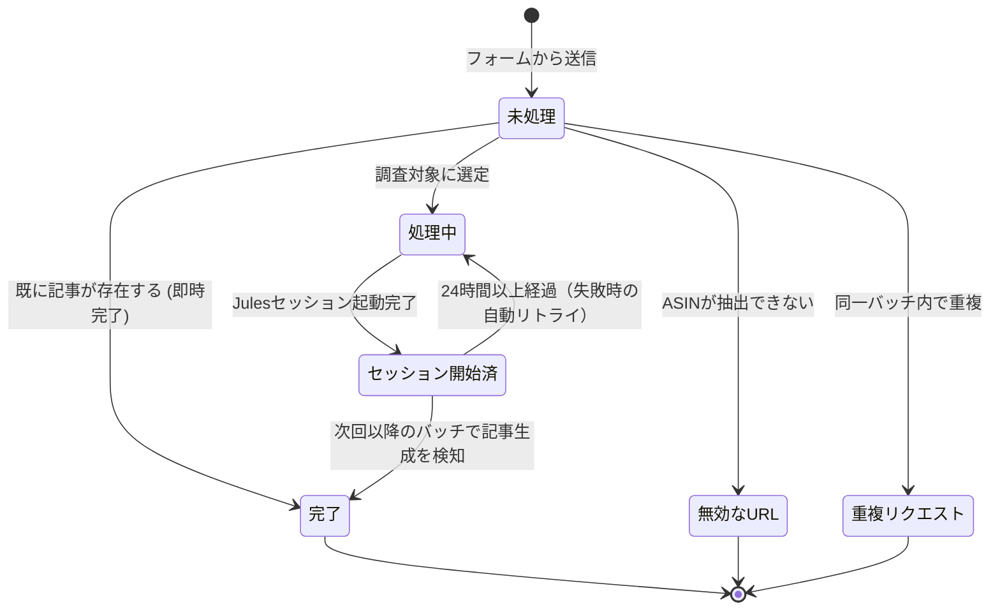

# ユーザー商品調査リクエスト連携システム 仕様・運用ドキュメント

本文書は、ユーザー（読者）からの商品調査リクエストをGoogleフォーム経由で匿名受付し、GitHub Actions、Creators API、および Jules AI と連携して自動で商品調査・記事生成・ステータス更新を行う「ユーザー商品調査リクエスト連携システム」のアーキテクチャ、データフロー、ステータス遷移、および運用保守手順を体系的にまとめたものである。

---

## 1. システム概要と設計方針

### 1.1 概要
訪問者がサイト上の「📝 調査リクエスト」ボタンからGoogleフォームを開き、記事化を希望するAmazon商品のURLを送信すると、システムが定期的（1時間に1回程度）にリクエストを自動収集し、商品調査および比較記事の作成・公開までを自律的に実行する。

### 1.2 設計方針
- **完全匿名性の担保**:
  Googleアカウントへのログインを要求せず、メールアドレス等の個人情報は一切収集・記録しない。
- **重複調査・無駄なAPI呼び出しの防止**:
  既にサイト上に記事（`data/investigations/<ASIN>.json`）が存在する商品や同一バッチ内での重複リクエストは自動検知してスキップし、スプレッドシート側を「完了」「重複リクエスト」に即時更新する。
- **調査枠の確保（キャパシティ保証）**:
  調査済みスキップが発生しても、未調査の新規対象商品が1件集まるまで探索を継続する。
- **障害耐性と自動リトライ**:
  Julesセッションの失敗等により記事が生成されなかった場合、24時間のタイムアウト判定を経て自動的に再調査対象としてリカバリする。
- **透明性の高いフィードバック（動的待ち件数・目安表示）**:
  フォーム送信完了画面（確認メッセージ）に、現在の調査待ち件数および調査開始までの目安時間をリアルタイムに動的表示する。
- **多様なURL形式の柔軟なサポート**:
  ブラウザの長いURL（日本語パスやトラッキングパラメータ付き）から、公式アプリの短縮URL（`amzn.asia`, `amzn.to`, `link.amazon`, `a.co`）までをシームレスに自動判別・解決する。

---

## 2. 全体アーキテクチャとデータフロー



---

## 3. コンポーネント構成と役割

| コンポーネント | ファイル / リソース | 役割・責務 |
|---|---|---|
| **Googleフォーム** | `https://docs.google.com/forms/...` | ユーザー向けURL入力UI。完全匿名受付とURL形式の正規表現バリデーションを実施。 |
| **Googleスプレッドシート** | `Amazon商品調査リクエスト管理シート` | フォーム回答の蓄積と処理ステータス・ASIN・実行日時・備考の管理。 |
| **GAS 初期化スクリプト** | `gas/src/setup.js` | フォーム・スプレッドシート・管理ヘッダーの自動生成および文言・バリデーション更新。 |
| **GAS Web API** | `gas/src/api.js` | GHAからのHTTPリクエスト（GET/POST）に応答し、セキュアにデータの抽出・更新を実施。 |
| **調査ヘルパー** | `src/scripts/user-requests-helper.ts` | 短縮URL解決、ASIN抽出正規表現、既存調査チェック、GAS APIクライアント。 |
| **調査連携 CLI** | `src/scripts/investigate-user-requests-cli.ts` | `--fetch-requests`（対象抽出・完了昇格）と `--update-status`（セッション更新）のバッチ制御。 |
| **GHA ワークフロー** | `.github/workflows/investigate-user-requests.yml` | 1時間に1回の定期実行パイプライン。調査からJulesセッション起動までを一括オーケストレーション。 |
| **サイトUI導線** | `layouts/index.html`<br>`layouts/_default/single.html`<br>`layouts/partials/header.html` | トップページ、商品個別ページ、ドロワーメニューに設置されたフォームへのリンクボタン。 |

---

## 4. スプレッドシートのデータ構造とステータス遷移

### 4.1 列定義

| 列 | 列名 | 設定主体 | 説明 |
|---|---|---|---|
| **A** | タイムスタンプ | Googleフォーム | 回答送信日時（JST） |
| **B** | Amazon商品のURL | Googleフォーム / ユーザー | 入力された商品URL（通常URLまたは短縮URL） |
| **C** | ステータス | 調査システム (GAS API) | 現在の処理状態（下記ステータス一覧参照） |
| **D** | ASIN | 調査システム (GAS API) | 抽出・特定された10桁のAmazon商品コード |
| **E** | 処理日時 | 調査システム (GAS API) | 最終ステータス更新日時（`yyyy-MM-dd HH:mm:ss`） |
| **F** | 備考 | 調査システム (GAS API) | スキップ理由や調査開始・完了メッセージ |

### 4.2 ステータス一覧と遷移ルール



- **`未処理`**（または空文字）:
  ユーザーから送信された初期状態。
- **`無効なURL`**:
  入力された文字列からAmazonのASINが検出できなかった状態（終了ステータス）。
- **`重複リクエスト`**:
  同一バッチ内で同じASINが複数回リクエストされた場合の2件目以降（終了ステータス）。
- **`処理中`**:
  GitHub Actionsの実行対象として選定され、商品情報取得が開始された状態。
- **`セッション開始済`**:
  Creators APIでのデータ収集が完了し、Jules AIによる調査・記事生成セッションが開始された状態。
- **`完了`**:
  サイト上に記事・調査結果ファイル（`data/investigations/<ASIN>.json`）が生成・公開されたことが確認された状態（終了ステータス）。

---

## 5. URL解析と短縮URL対応仕様

`user-requests-helper.ts` の `extractAsinFromUrl` は、以下のURL形式をすべて自動解決する。

### 5.1 サポートする短縮URLドメイン
以下のドメインを含むURLが渡された場合、HTTP `GET`（リダイレクト最大5回追従）を発行して展開後の最終URLを取得する。
- `https://amzn.asia/...`
- `https://amzn.to/...`
- `https://link.amazon/...`（最新のAmazon短縮URL）
- `https://a.co/...`

### 5.2 ASIN抽出パターン
展開後のURLに対し、以下の優先順位で10桁の英数字（ASIN）を抽出する。
1. `/(?:\/dp\/|\/gp\/product\/|\/ASIN\/|\/d\/)([A-Z0-9]{10})/i`（標準パス形式）
2. `/[?&]asin=([A-Z0-9]{10})/i`（クエリパラメータ形式）
3. `/(?:^|\/)([A-Z0-9]{10})(?:[/?#]|$)/i`（末尾パス形式）

---

## 6. 運用・保守手順

### 6.1 初期セットアップ手順（新規環境構築時）

1. **GASプロジェクトの作成とプッシュ**:
   `gas` ディレクトリで直接 `clasp push` を実行する：
   ```bash
   cd gas
   clasp push
   ```
2. **初期化スクリプトの実行**:
   - Google Apps Scriptエディタで `setup.js` を開き、`setupProductRequestSystem()` を実行する。
   - 実行ログに出力される以下の情報を控える：
     - `公開用フォームURL`
     - `スプレッドシートID`
     - `API認証トークン (API_TOKEN)`
3. **Web API のデプロイ**:
   ```bash
   cd gas
   clasp deploy
   ```
   - 出力されたデプロイURL（`https://script.google.com/macros/s/.../exec`）を控える。
4. **GitHub Secrets の設定**:
   リポジトリの Settings > Secrets and variables > Actions に以下を登録する：
   - `GAS_API_URL`: Web APIのデプロイURL
   - `GAS_API_TOKEN`: `API_TOKEN` の文字列
5. **サイト設定への反映**:
   `config.toml` の `params.productRequestFormUrl` に公開用フォームURLを登録する。

---

### 6.2 フォーム説明文やバリデーションの更新手順

Googleフォームの説明文やURLバリデーションルール（新しい短縮URLドメインの追加など）を更新する場合、フォームURLやスプレッドシート連携を維持したまま即時反映できる。

1. `gas/src/setup.js` の `FORM_DESCRIPTION` や `urlValidation` パターンを編集する。
2. `gas` ディレクトリで直接GASにプッシュする：
   ```bash
   cd gas
   clasp push
   ```
3. GASエディタから **`updateFormDescription()`** を実行する（フォームの説明文と補足テキスト、バリデーションが即座に最新化される）。

---

### 6.3 トラブルシューティング

#### Q1. GHA実行時に `Request failed with status code 404` が発生する
- **原因**: `GAS_API_URL` に設定されているURLが古いか、デプロイされていない。
- **対処**: GASエディタの「デプロイ」>「デプロイを管理」から、Webアプリのアクセス権限が「全員（全員がアクセス可能）」になっているか確認し、正しい `/exec` URLをGitHub Secretsに再設定する。

#### Q2. GHA実行時に `Unauthorized: Invalid or missing token` が発生する
- **原因**: `GAS_API_TOKEN` がスプレッドシート側のスクリプトプロパティ `API_TOKEN` と一致していない。
- **対処**: GASエディタの「プロジェクトの設定」>「スクリプト プロパティ」にある `API_TOKEN` の値とGitHub Secretsの値を一致させる。

#### Q3. Julesが失敗してリクエストが「セッション開始済」のまま放置されている
- **自動復旧**: 24時間以上経過すると、次回の定期実行（1時間に1回程度）で自動的にタイムアウト判定され、再調査対象としてリトライされる。
- **手動復旧**: スプレッドシート上で該当行のステータス（C列）を `未処理` に手動変更すれば、次回の実行ですぐに再調査される。
